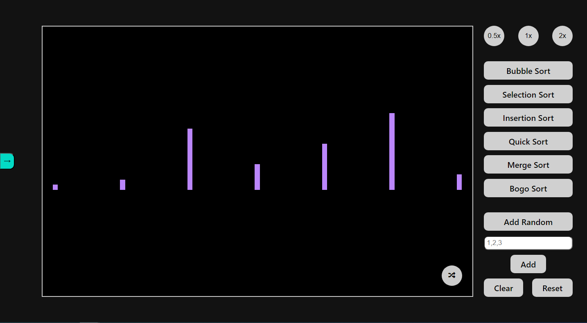
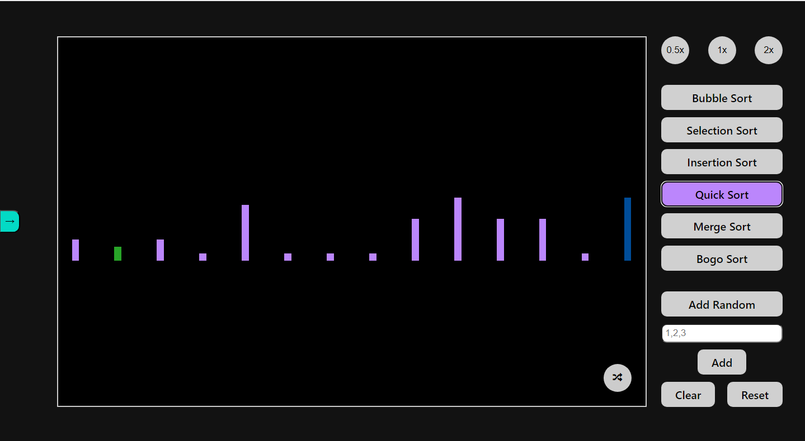

# Sorting Visualization

Visual Sorting Algorithms to projekt, który umożliwia wizualizację działania różnych algorytmów sortowania. Pozwala to lepiej zrozumieć, jak działają te algorytmy.

## Instalacja

1. Sklonuj repozytorium na swoim komputerze za pomocą `git clone https://github.com/username/repo-name.git`.
2. Przejdź do katalogu projektu za pomocą `cd repo-name`.
3. Zainstaluj wymagane zależności za pomocą `npm install`.

## Użycie

1. Wybierz preferowaną szybkość (domyślnie 1x).
2. Zmień wyświetlaną tablicę.
3. Wybierz algorytm, który chcesz sprawdzić.
4. Zresetuj i sprawdź inne algorytmy.

## Wspierane algorytmy sortowania

- Bubble Sort
- Selection Sort
- Insertion Sort
- Bogo Sort
- Quick Sort
- Merge Sort

## Aplikacja:

